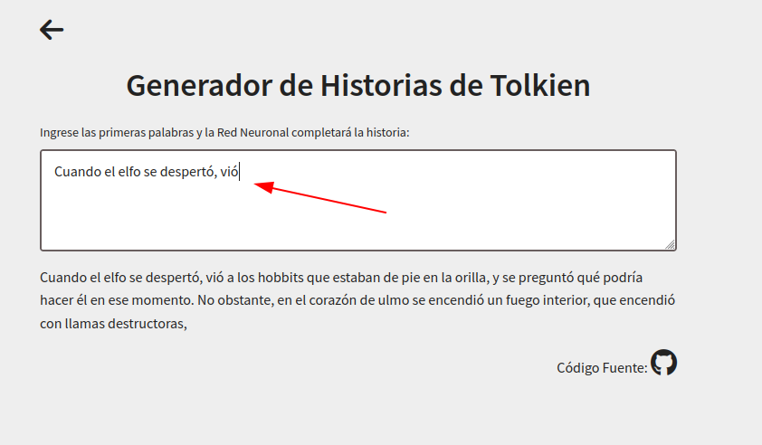
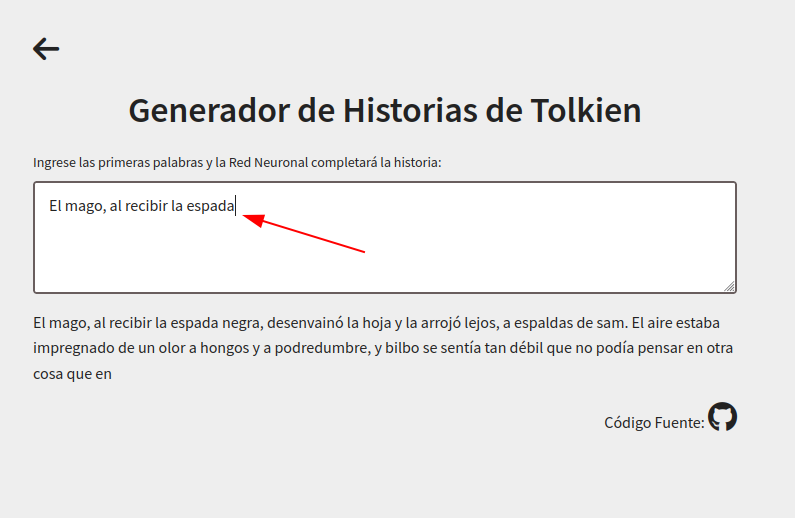

# Tolkien's Histories Text Generator

The project consists in an spanish pretrained GPT2 network. Which we have fine tuned using 
Tolkien's universe gathered data as a txt file.

## Requirements

The project was developed in a Python 3.9 environment using the following libraries:
* For Data transcription from different sources:
    1. [epub_conversion](https://pypi.org/project/epub-conversion/)
    2. [pydub](http://pydub.com/)
    3. [PyPDF2](https://pypi.org/project/PyPDF2/)
    4. [SpeechRecognition](https://pypi.org/project/SpeechRecognition/)
    5. [tqdm](https://tqdm.github.io/)
* For the core program:
    6. [transformers](https://pypi.org/project/transformers/)
    7. [PyTorch](https://pytorch.org/)
* For deployment:
    8. [streamlit](https://streamlit.io/)

Run `pip install -r requirements.txt` on terminal to install all the dependencies. Inside the 
directory,
run
```
streamlit run text_generator_app.py
```

to deploy the app on local.

Also, if you want to try it remotely, visit 
[this website](https://share.streamlit.io/crisleaf/tolkien_text_generator/text_generator_app.py).

## Dataset

The dataset was gathered using different kind of sources of the following types: `.mp3`, `.
wav`, `.pdf` and `.epub`.

## Methodology

First we downloaded the pretrained GPT2 spanish network `DeepESP/gpt2-spanish` as well as the 
tokenizer, from the [Hugging Face website](https://huggingface.co/DeepESP/gpt2-spanish). 
The 
transformer network was trained using an spanish Wikipedia Corpus.

We fine tuned the pretrained network, using a Google Colab service and the Tolkien's data, with the 
`text_generator_train.ipynb`, and uploaded it into a 
[Hugging Face repository](https://huggingface.co/CrisLeaf).

Finally, we created an app using [streamlit](https://streamlit.io/), that loads the model and 
generates text.


## Examples

Example 1:

 

Example 2:



## Support

Give a :star: if you like it :hugs:.